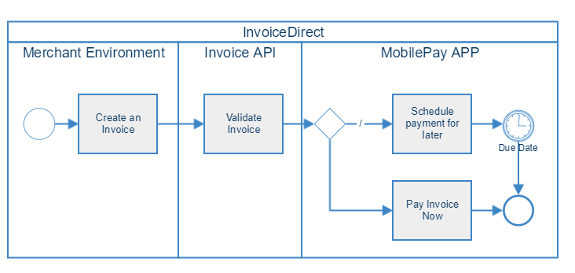
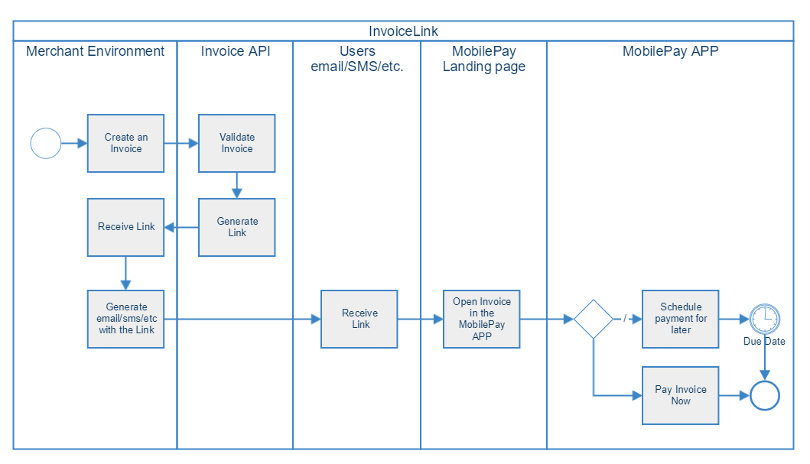

## Web API Reference

### <a name="direct"/> InvoiceDirect

High level `InvoiceDirect` flow diagram

[](Invoice_direct_high_level_flow_diagram.png)

#### Create InvoiceDirect

You can create an invoice directly to MobilePay app. Notice that request require a customer mobile phone number, name and surname. Check how invoice looks in the app [here](visual_examples).

```
POST api/v1/merchants/{merchantId}/invoices
```

##### <a name="single_invoice_object"/> Input

|Parameter             |Sub Parameter |Type        |Description |
|----------------------|--------------|------------|------------|
|`InvoiceIssuer`       ||`guid`| **Required.** The ID of the invoicing department/branch of the merchant.                                   |
|`ConsumerAlias`       ||`object`| **Required.** Mobile alias of the MobilePay user to be invoiced.                                                 |
||`Alias`|`string`|**Required.** Mobile phone number of the MobilePay user. Should start with a '+' sign and country phone code. <br/> E.g. +4512345678 or +35812345678                          |
||`AliasType`|`string` | **Required.** Alias type of the MobilePay user. <br/> Only value allowed is `Phone`.                                                            |
|`ConsumerName`      |              |`string`      |**Required.** Full name of the MobilePay user.|
|`TotalAmount`       |              |`decimal`     |**Required.** The requested amount to be paid. <br/> >0.00, decimals separated with a dot.|
|`TotalVatAmount`    |              |`decimal`     |**Required.** VAT amount. Decimals separated with a dot.                                  |
|`CountryCode`       |              |`string(2)`   |**Required.** Country code. Either `DK` or `FI` is allowed.                             |
|`CurrencyCode`      |              |`string(3)`   |**Required.** Currency code. If you set `CountryCode` as `DK` then it should be `DKK`. If you set `CountryCode` as `FI` then it should be `EUR`.|
|`ConsumerAddressLines`|            |`string[]`      |**At least one is required.** Address of consumer receiving the invoice.                                |
|`DeliveryAddressLines`|            |`string[]`      |Delivery address.                                                                       |
|`InvoiceNumber`     |              |`string`      |**Required.** Invoice number. It will be used if PaymentReference is not filled.                                                           |
|`IssueDate`         |              |`date`        |**Required.** Issue date of invoice. ISO date format: `YYYY-MM-DD`                      |
|`DueDate`           |              |`date`        |**Required.** Payment due date. Must be between today and 400 days ahead, otherwise the request will be declined. ISO date format: `YYYY-MM-DD`|
|`OrderDate`         |              |`date`        |**Required.** Order date of invoice. ISO date format: `YYYY-MM-DD`                      |
|`DeliveryDate`      |              |`date`        |**Required.** Delivery date of invoice. ISO date format: `YYYY-MM-DD`                   |
|`Comment`           |              |`string`      |Additional information to the consumer.                                                 |
|`MerchantContactName`|             |`string`      |Contact name for the individual who issued the invoice.                                 |
|`MerchantOrderNumber`|             |`string`      |The merchant order number for the invoice used internally by the merchant.              |
|`BuyerOrderNumber`|                |`string`        |The buyer order number for the invoice used externally by the merchant.               |
|`PaymentReference`  |              |`string(60)`  |Reference used on the payment to do reconciliation if merchant has chosen Instant Transfer method. If not filled, InvoiceNumber will be used as reference.|
|`InvoiceUrl`  |              |`string`  |URL to the Invoice PDF provided by merchant.|
|`InvoiceArticles` |            |`array`      |**At least one is required.**                                                                |
|    |`ArticleNumber`           |`string`     |**Required.** Article Number, e.g. 123456ABC                                                 |
|    |`ArticleDescription`      |`string`     |**Required.** Article Description.                                                           |
|    |`VATRate`                 |`decimal`    |**Required.** VAT Rate of article.                                                            |
|    |`TotalVATAmount`          |`decimal`    |**Required.** Total VAT amount of article. Decimals separated with a dot.                                                    |
|    |`TotalPriceIncludingVat`  |`decimal`    |**Required.** Total price of article including VAT.                                          |
|    |`Unit`                    |`string`     |**Required.** Unit, e.g. Pcs, Coli.                                                          |
|    |`Quantity`                |`decimal`    |**Required.** Quantity of article. Allowed to have more than two decimal digits.             |
|    |`PricePerUnit`            |`decimal`    |**Required.** Price per unit. Allowed to have more than two decimal digits.                  |
|    |`PriceReduction`          |`decimal`    |**Required.** Price reduction.                                                                             |
|    |`PriceDiscount`           |`decimal`    |**Required.** Price discount.                                                                              |
|    |`Bonus`                   |`decimal`    |**Required.** Bonus of article.                                                                            |

##### Example

```json
{
  "InvoiceIssuer": "efd08c19-24cf-4833-a4a4-bfa7bd58fbb2",
  "ConsumerAlias": {
    "Alias": "+4577007700",
    "AliasType": "Phone"
  },
  "ConsumerName": "Consumer Name",
  "TotalAmount": 360,
  "TotalVATAmount": 72,
  "CountryCode": "DK",
  "CurrencyCode": "DKK",
  "ConsumerAddressLines": [
    "Paradisæblevej 13",
    "CC-1234 Andeby", 
    "WONDERLAND"
  ],
  "DeliveryAddressLines": [
    "Østerbrogade 120",
    "CC-1234 Andeby",
    "WONDERLAND"
  ],
  "InvoiceNumber": "301",
  "IssueDate": "2018-02-12",
  "DueDate": "2018-03-12",
  "OrderDate": "2018-02-05",
  "DeliveryDate": "2018-02-10",
  "Comment": "Any comment",
  "MerchantContactName": "Snowboard gear shop",
  "MerchantOrderNumber": "938",
  "BuyerOrderNumber": "631",
  "PaymentReference": "186",
  "InvoiceArticles": [
    {
      "ArticleNumber": "1-123",
  "ArticleDescription": "Process Flying V Snowboard",
      "VATRate": 25,
      "TotalVATAmount": 72,
      "TotalPriceIncludingVat": 360,
      "Unit": "1",
      "Quantity": 1,
      "PricePerUnit": 288,
      "PriceReduction": 0,
      "PriceDiscount": 0,
      "Bonus": 5
    }      
  ]
}
```

Response

```
HTTP 202 Accepted
```
```json
{
    "InvoiceId" : "63679ab7-cc49-4f75-80a7-86217fc105ea"
}
```
<div class="note">
Note: If not accepted, invoice will expire 30 days after due date.
</div>

#### <a name="create_multiple_invoicedirect"/> Create multiple invoices 
```
POST api/v1/merchants/{merchantId}/invoices/batch
```

You can create up to 2000 invoices per single batch.

##### Input (an array of <a href="#single_invoice_object">objects</a> used to create single invoice)
```json
[
  {
     // InvoiceDirect input
  },
  {
     // InvoiceDirect input
  },
  ...
]
```
##### Response
```
HTTP 202 Accepted
```
```json
{
  "Accepted": [
    {
      "InvoiceNumber": "<original invoice number sent by the merchant>",
      "InvoiceId": "66119129-aaf7-4ad0-a5b1-62382932b5c6"
    },
    {
      "InvoiceNumber": "<original invoice number sent by the merchant>",
      "InvoiceId": "5e3030a3-61ff-4143-a6bd-8457a09bcb0d"
    },
    ...
  ],
  "Rejected": [
    {
      "InvoiceNumber": "<original invoice number sent by the merchant>",
      "ErrorText": "<description of error>",
      "ErrorCode": 10504
    },
    ...
  ]
}
```

<div class="note">
<strong>Note:</strong> When multiple invoices are sent, most of the validation is applied asynchronously. The result are sent via <a href="/callbacks">callbacks</a>.
</div>

### <a name="link"/> InvoiceLink

High level `InvoiceLink` flow diagram

[](Invoice_link_high_level_flow_diagram.png)

#### Create InvoiceLink

You can create an invoice and receive a link. That link can be sent to the user by any channel like email, sms, etc. and user can choose to pay with MobilePay. Check `InvoiceLink` flows and how invoice looks in the app [here](visual_examples#link-flows).

<div class="note">
Note: Request does not require a <code>ConsumerAlias</code>. It's because InvoiceLink can be paid by any MobilePay user.
</div>

```
POST api/v1/merchants/{merchantId}/invoices/link
```

##### <a name="single_invoicelink_object"/> Input

|Parameter             |Sub Parameter |Type        |Description |
|----------------------|--------------|------------|------------|
|`InvoiceIssuer`       ||`guid`| **Required.** The ID of the invoicing department/branch of the merchant.                                   |
|`ConsumerAlias`       ||`object`|Mobile alias of the MobilePay user to be invoiced.                                                 |
||`Alias`|`string`|Mobile phone number of the MobilePay user. Should start with a '+' sign and country phone code. <br/> E.g. +4512345678 or +35812345678                          |
||`AliasType`|`string` |Alias type of the MobilePay user. This will be autofilled in the landing page if user opens the link not on the phone <br/> Only value allowed is `Phone`.                                                            |
|`ConsumerName`      |              |`string`      |**Required.** Full name of the MobilePay user.|
|`TotalAmount`       |              |`decimal`     |**Required.** The requested amount to be paid. <br/> >0.00, decimals separated with a dot.|
|`TotalVatAmount`    |              |`decimal`     |**Required.** VAT amount. Decimals separated with a dot.                                  |
|`CountryCode`       |              |`string(2)`   |**Required.** Country code. Either `DK` or `FI` is allowed.                             |
|`CurrencyCode`      |              |`string(3)`   |**Required.** Currency code. If you set `CountryCode` as `DK` then it should be `DKK`. If you set `CountryCode` as `FI` then it should be `EUR`.|
|`ConsumerAddressLines`|            |`string[]`    |**At least one is required..** Address of consumer receiving the invoice.                                |
|`DeliveryAddressLines`|            |`string[]`    |Delivery address.                                                                       |
|`InvoiceNumber`     |              |`string`      |**Required.** Invoice number.                                                           |
|`IssueDate`         |              |`date`        |**Required.** Issue date of invoice. ISO date format: `YYYY-MM-DD`                      |
|`DueDate`           |              |`date`        |**Required.** Payment due date. Must be between today and 400 days ahead, otherwise the request will be declined. ISO date format: `YYYY-MM-DD`|
|`OrderDate`         |              |`date`        |**Required.** Order date of invoice. ISO date format: `YYYY-MM-DD`                      |
|`DeliveryDate`      |              |`date`        |**Required.** Delivery date of invoice. ISO date format: `YYYY-MM-DD`                   |
|`Comment`           |              |`string`      |Additional information to the consumer.                                                 |
|`MerchantContactName`|             |`string`      |Contact name for the individual who issued the invoice.                                 |
|`MerchantOrderNumber`|             |`string`      |The merchant order number for the invoice used internally by the merchant.              |
|`BuyerOrderNumber`|                |`string`      |The buyer order number for the invoice used externally by the merchant.               |
|`PaymentReference`  |              |`string(60)`  |Reference used on the payment to do reconciliation. If not filled, invoice number will be used as reference.|
|`InvoiceUrl`  |              |`string`  |URL to the Invoice PDF provided by merchant.|
|`InvoiceArticles` |            |`array`      |**At least one is required.**                                                                |
|    |`ArticleNumber`           |`string`     |**Required.** Article Number, e.g. 123456ABC                                                 |
|    |`ArticleDescription`      |`string`     |**Required.** Article Description.                                                           |
|    |`VATRate`                 |`decimal`    |**Required.** VAT Rate of article.                                                           |
|    |`TotalVATAmount`          |`decimal`    |**Required.** Total VAT amount of article. >0.00, decimals separated with a dot                                                   |
|    |`TotalPriceIncludingVat`  |`decimal`    |**Required.** Total price of article including VAT. >0.00, decimals separated with a dot                                          |
|    |`Unit`                    |`string`     |**Required.** Unit, e.g. Pcs, Coli.                                                          |
|    |`Quantity`                |`decimal`    |**Required.** Quantity of article.                                                           |
|    |`PricePerUnit`            |`decimal`    |**Required.** Price per unit.                                                                |
|    |`PriceReduction`          |`decimal`    |**Required.** Price reduction.                                                                             |
|    |`PriceDiscount`           |`decimal`    |**Required.** Price discount.                                                                              |
|    |`Bonus`                   |`decimal`    |**Required.** Bonus of article.                                                                            |

##### Example

```json
{
  "InvoiceIssuer": "efd08c19-24cf-4833-a4a4-bfa7bd58fbb2",
  "ConsumerAlias": {
    "Alias": "+4577007700",
    "AliasType": "Phone"
  },
  "ConsumerName": "Consumer Name",
  "TotalAmount": 360,
  "TotalVATAmount": 72,
  "CountryCode": "DK",
  "CurrencyCode": "DKK",
  "ConsumerAddressLines": [
    "Paradisæblevej 13",
    "CC-1234 Andeby", 
    "WONDERLAND"
  ],
  "DeliveryAddressLines": [
    "Østerbrogade 120",
    "CC-1234 Andeby",
    "WONDERLAND"
  ],
  "InvoiceNumber": "301",
  "IssueDate": "2018-02-12",
  "DueDate": "2018-03-12",
  "OrderDate": "2018-02-05",
  "DeliveryDate": "2018-02-10",
  "Comment": "Any comment",
  "MerchantContactName": "Snowboard gear shop",
  "MerchantOrderNumber": "938",
  "BuyerOrderNumber": "631",
  "PaymentReference": "186",
  "InvoiceArticles": [
    {
      "ArticleNumber": "1-123",
      "ArticleDescription": "Process Flying V Snowboard",
      "VATRate": 25,
      "TotalVATAmount": 72,
      "TotalPriceIncludingVat": 360,
      "Unit": "1",
      "Quantity": 1,
      "PricePerUnit": 288,
      "PriceReduction": 0,
      "PriceDiscount": 0,
      "Bonus": 5
    }      
  ]
}
```

##### Response
```
HTTP 202 Accepted
```
```json
{
    "InvoiceId": "c5d4fde3-81e2-49de-8cfe-8c96f449e367",
    "Links": [
        {
            "Rel": "user-redirect",
            "Href":"https://api.sandbox.mobilepay.dk/invoice-restapi/api/v1/consumers/me/invoices/invoices/c5d4fde3-81e2-49de-8cfe-8c96f449e367/link"
        }
    ]
}
```

#### <a name="create_multiple_invoice_links"/> Create multiple invoice links

```
POST api/v1/merchants/{merchantId}/invoices/link/batch
```

You can create up to 2000 invoice links per single batch.

##### Input (an array of <a href="single_invoicelink_object">objects</a> used to create single invoice link)
```json
[
  {
    InvoiceLink input,
  },
  {
    InvoiceLink input,
  },
  ...
]
```

##### Response
```
HTTP 202 Accepted
```
```json
{
  "Accepted": [
    {
      "InvoiceNumber": "<original invoice number sent by the merchant>",
      "InvoiceId": "66119129-aaf7-4ad0-a5b1-62382932b5c6"
    },
    {
      "InvoiceNumber": "<original invoice number sent by the merchant>",
      "InvoiceId": "5e3030a3-61ff-4143-a6bd-8457a09bcb0d"
    },
    ...
  ],
  "Rejected": [
    {
      "InvoiceNumber": "<original invoice number sent by the merchant>",
      "ErrorText": "<description of error>",
      "ErrorCode": 10504
    },
    ...
  ]
}
```

<div class="note">
Note: The success response is not much different from the regular, non-batch response, but 
it doesn't contain the link itself. This is because we are processing batches asynchronously and can't return an immediate result. The <code>InvoiceLink</code> URLs will be sent back to you via a <a href="callbacks">callback</a>, as soon as they're created.
</div>

### <a name="canceling"/> Cancel invoice
You can cancel an invoice which has not yet been paid, rejected and has not expired.
```
PUT api/v1/merchants/{merchantId}/invoices/{invoiceId}/cancel
```

##### Response
```
HTTP 204 No Content
```

### <a name="get-details"/> Get invoice details

```
GET api/v1/merchants/{merchantId}/invoices/{invoiceId}
```
##### Response

```
HTTP 200 OK
```
```json
{
    "InvoiceId": "578a9f10-4e81-4265-bbae-2e8fa33cb83b",
    "InvoiceNumber": "301",
    "IssueDate": "2018-07-02",
    "DueDate": "2018-08-02",
    "Comment": "Sample Invoice",
    "InvoiceArticles": [
        {
          "ArticleNumber": "1-123",
          "ArticleDescription": "Process Flying V Snowboard",
          "TotalPriceIncludingVat": 360,
          "Quantity": 1,
          "PricePerUnit": 288,
        }
    ],
    "CurrencyCode": "DKK",
    "TotalAmount": 360,
    "InvoiceVatTotals": [
        {
            "VatRate": 25,
            "TotalVatAmount": 72
        }
    ],
    "TotalVatAmount": 72,
    "TotalAmountExcludingVat": 288,
    "MerchantId": "f3dd9011-d930-4063-901d-2a47621e5b76",
    "InvoiceIssuerId": "238fe387-f4a4-40e7-ae8a-4c107da2c0ad",
    "InvoiceIssuerName": "Invoice Issuer 1",
    "InvoiceIssuerAddress": "Edwin Rahrs Vej 2-12",
    "InvoiceIssuerZipcode": "8220",
    "InvoiceIssuerCity": "Brabrand",
    "MerchantIsoCountryCode": "DK",
    "LogoUrl": "https://api.qa.mobilepay.dk/invoice-restapi/api/v1/invoiceissuers/238fe387-f4a4-40e7-ae8a-4c107da2c0ad/logo",
    "Status": "created",
    "InvoiceUrl":"https://api.merchant.dk/invoice/578a9f10-4e81-4265-bbae-2e8fa33cb83b/pdf"
}
```

### <a name="get-status"/> Get invoice status

```
GET api/v1/merchants/{merchantId}/invoices/{invoiceId}/status
```
##### Response

```
HTTP 200 OK
```
```json
{
    "InvoiceId" : "5e1210f9-4153-4fc3-83ec-2a8fc4843ea6",
    "Status" : "created"
}
```

The table below shows all possible statuses.

|Status       | Explanation                                                 | Type         |
|-------------|-------------------------------------------------------------|--------------|
|`created`    |_Merchant created the Invoice_                               | Intermediate |
|`invalid`    |_Invoice validation failed_                                  | Intermediate |
|`accepted`   |_User swiped to accept the Invoice_                          | Intermediate |
|`paid`       |_Invoice was paid_                                           | Final        |
|`rejected`   |_User rejected the Invoice_                                  | Final        |
|`expired`    |_User did not do do anything until Invoice DueDate + 30 days_| Final        |
|`canceled`   |_You canceled this invoice._                                 | Final        |

User accepts the invoice and then pays it immediately or schedules a future payment. The user can change the date, for when the invoice should be paid in the MobilePay app, but nor more than 30 days from the DueDate. For InvoiceLink to be in `rejected` state, the user needs to have first `accepted` the invoice and scheduled for a future payment. Afterwards, it is possible for the user to reject the invoice. 

There are two validation steps :  
1. Merchant validation: If all is good, then MobilePay create the invoice, send the callback `created` to the merchant, and push message to the user. The outcome of this validation is that the Invoice is `created` and delivered to the user, or the Invoice failed to be `created`, and is returned to the merchant. If the validation fails, then MobilePay does not create invoice as an entity in MobilePay domain, so in a way it is kinda a final state. 


2. User validation: Card validation, user status.. etc. The invoice is delivered to the user, when the merchant received callback about `created` invoice. The outcome of this validation is either that the Invoice is `paid` or an error message is returned in the app.   


The first state is either `created` or `invalid`. If you received a callback with status `created` then the Invoice has been delivered to the user. 

Invoice status flow can be visualized by the following diagram.

[](assets/images/invoice_flow.png)

### <a name="error-codes"/> Error Codes

All of the endpoints described above can return an error response of this structure:

|Name                |Type    | Description                                                               |
|--------------------|------------------------------------------------------------------------------------|
|`correlation_id`    |`guid`  | Unique id used for logging and debugging purposes.                        |
|`error`             |`string`| Error type. Possible values: `DomainError`, `InputError` & `ServerError`. |
|`error_code`        |`string`| Unique error code.                                                        |
|`error_description` |`string`| Human-friendly error description.                                         |
|`error_context`     |`string`| Identifies context in which error has occured.                            |

1. `HTTP 400` , if request input is invalid
>
  ```json
  {
      "correlation_id": "54ccc98b-7d9f-40ea-8c1a-249d57126c39",
      "error": "InputError",
      "error_code": null,
      "error_description": "input.TotalAmount : Invalid input\r\n",
      "error_context": "Invoices"
  }
  ```

2. `HTTP 409` , request is not compatible with a current state
>
  ```json
  {
      "correlation_id": "8c153279-98f1-4e33-b053-3c6e3555adff",
      "error": "DomainError",
      "error_code": "10504",
      "error_description": "Invoice has already been paid",
      "error_context": "Invoices"
  }
  ```

3. `HTTP 500` , server error
>
  ```json
  {
      "correlation_id": "56db684c-7845-4abf-9f19-5632a625a47b",
      "error": "ServerError",
      "error_code": null,
      "error_description": "The given key was not present in the dictionary.",
      "error_context": "Invoices"
  }
  ```

When creating `InvoiceDirect` or `InvoiceLink` these values can be returned as `error_code` and `error_description`:

|Error Code |Error Description                                                                  |
|-----------|-----------------------------------------------------------------------------|
|10101      |MobilePay user not found                                                     |
|10102      |MobilePay user not available                                                 |
|10103      |MobilePay user not found                                                     |
|10104      |Invoice already exists                                                       |
|10105      |Technical error - please contact MobilePay developer support  developer@mobilepay.dk |
|10008      |Total amount must be greater than 0                                          |
|10106      |Invoice country does not match consumer country                              |
|10107      |Specified currency does not match specified country                          |
|10201      |Total invoice amount is exceeded                                             |
|10202      |Invoice issuer not found                                                     |
|10203      |Account validation error                                                     |
|10204      |Account validation error                                                     |
|10205      |Technical error - please contact MobilePay developer support  developer@mobilepay.dk |
|10301      |Invoice already exists                                                       |
|10302      |Merchant not found                                                           |
|10303      |Invoice issuer not found                                                     |
|10304      |MobilePay user not found                                                     |
|10305      |MobilePay user not found                                                     |
|10306      |MobilePay user not found                                                     |
|10310      |DueDate must be no later than 400 days from today                            |
|10311      |DueDate must be today or later                                               |
|10312      |IssueDate must be no later than today                                        |
|10314      |Your daily limit has been reached. No more than 10 invoices can be created per consumer per merchant per day. |

### <a name="validations"/> Validations

A set of business rules apply for an `invoice` before it gets created. If any of following rules fail, an `invoice` falls to `Not Created` state and a response with `error_code` and `error_description` is returned.

|Field          |Country   |Validation                                         |Error Code |Description                                                       |
|---------------|----------|---------------------------------------------------|-----------|------------------------------------------------------------------|
|`DueDate`      |DK/FI     |CreatedDate < DueDate < CreatedDate + 400 days  |10310/10311|`DueDate` must be no more than 400 days in the future.               |
|`IssueDate`    |DK/FI     |IssueDate <= CreatedDate                         |10312      |`IssueDate` can not be later than invoice creation date.            | 
|`CountryCode`  |DK/FI     |CountryCode == Consumer CountryCode              |10106      |`CountryCode` must match consumer's `CountryCode`.                  | 
|`CurrencyCode` |DK        |CurrencyCode == DKK                              |10107      |Only `DKK` is supported for DK invoices.                            |
|               |FI        |CurrencyCode == EUR                              |10107      |Only `EUR` is supported for FI invoices.                            |
|`TotalAmount`  |DK        |TotalAmount <= 15000 DKK                         |10201      |`TotalAmount` is limited to 15000 DKK.                              |
|               |FI        |TotalAmount <= 2000 EUR                           |10201      |`TotalAmount` is limited to 2000 EUR.                                |

## Push notifications 


|Description|Action|EN| DK | FI  |Device|
|----------|---------|---|-------------------|------------------------|----------------------|
|Push notification when User gets Invoice.   |_Open context screen_        |[Invoice Issuer name] wants to send you a bill  |[Invoice Issuer name] har en regning til dig  |  [Invoice Issuer name] haluaa lähettää sinulle laskun|iOS & Android|
|In app push when User gets Invoice    |_Open context screen_              |[Invoice Issuer name] wants to send you a bill  | [Invoice Issuer name] har en regning til dig|[Invoice Issuer name] haluaa lähettää sinulle laskun|(just for iOS)|
| Push notification when User opens Invoice via web  | Open context screen       |Pay a bill  | Betal en regning|Maksa lasku|iOS & Android|
|In app push when User opens Invoice via web   |Open context screen  | Pay a bill  | Betal en regning|Maksa lasku|(just for iOS)|
 

##### Limits
* Consumer daily invoice count <= 10. No more then 10 invoices can be created per consumer from single merchant.
