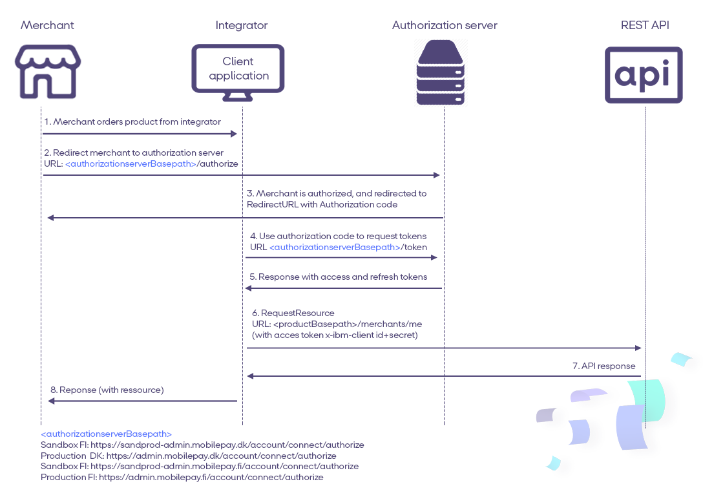

# <a name="invoiceclient_onboarding"></a>**Part 1 : Onboarding a Invoice client**

1. **Read API documentation.** You will find it in the  [APIs menu](https://sandbox-developer.mobilepay.dk/product).  
2. **Log-in on the developer portal.** Go to [Sandbox developer portal](https://sandbox-developer.mobilepay.dk/) and log in with your credentials.
3. **Create an app in the developer portal.** Go to My Apps > Create new App to register a new application. You need to supply the `x-ibm-client-id` when calling APIs. You should always store the `x-ibm-client-id` in a secure location, and never reveal it publicly.  More details about the usage of `x-ibm-client-id` below in the authentication section. 
4. **Subscribe the app to APIs.**  Go to [APIs](https://sandbox-developer.mobilepay.dk/product) and subscribe to the following APIs:
-  Invoice
-  Invoice User Simulation
5. **Receive OAuth  Credentials via zip file.** The Credentials will be used when calling the token endpoint (described below) to generate an `access token`. The zip file will be sent via e-mail. The zip file is locked with a password. DeveloperSupport will provide the password via text message. You will also receive a testuser to  [Sandbox MobilePay Portal](https://sandprod-admin.mobilepay.dk/)
6. **Send your redirect URI to developer@mobilepay.dk** The `redirect_uri` will be used once the user authenticates successfully. MobilePay will only redirect users to a registered `redirect_uri`, in order to prevent redirection attacks where an `authorization_code` or `access_token` can be obtained by an attacker. The `redirect_uri` must be an https endpoint to prevent tokens from being intercepted during the authorization process. You need to provide your own `redirect_uri` and send it to developer@mobilepay.dk so it can be whitelisted. We will whitelist is as soon as we process your email request and we will confirm via e-mail, once it has been whitelisted.

Now you are ready to move on to the authentication section below.  

## Overview of MobilePay Invoice integration 
When the merchant is onboarded via  [Production MobilePay Portal](https://admin.mobilepay.dk/), and has ordered MobilePay Invoice, then you can continue with OIDC. 

Note: if you are still working on the integration in sandbox, you will use [Sandbox MobilePay Portal](https://sandprod-admin.mobilepay.dk/) from step 5 in part 1.  

### OpenID flow
[](assets/images/OpenIdflowWithFIandAuthorize.png)    

When user clicks on this button, merchant must do back-end call to   
[`"/authorize"`](https://developer.mobilepay.dk/products/openid/authorize) endpoint for initiating  authentication flow. You need to wait for the response by listening on the redirect URI and get the Authorization Code. Our system will re-direct the merchant back to your system also using the redirect URL. 
 
## 5 steps to Implementing OpenID Connect 

There are many OpenID Connect certified libraries, so you have to chose the one, that suits you best [from this list](http://openid.net/developers/certified/#RPLibs). we recommend <a href="https://github.com/IdentityModel/IdentityModel.OidcClient2">Certified C#/NetStandard OpenID Connect Client Library </a> 

1. **Call /connect/authorize to initiate user login and consent**  The Merchant must grant consent through mechanism in the OpenID Connect protocol suite. The Hybrid Flow should be initiated. For Invoice product the Client must request consent from the merchant using the `invoice` scope. You also need to specify `offline_access` scope, in order to get the refresh token. When user clicks on this button, merchant must do back-end call to  `"/authorize"` endpoint for initiating  authentication flow. 
**Docs** [here](https://developer.mobilepay.dk/developersupport/openid/authorize/) 

2. **Wait for the response by listening on the redirect URI and get the authorization code** You need to wait for the response by listening on the `redirect_url` and get the `authorization_code`. Our system will re-direct the merchant back to your system also using the `redirect_url`. 
**Docs** [here](https://developer.mobilepay.dk/developersupport/openid/getcode/) 

3. **Exchange the authorization code for tokens using /connect/token** Once you got the `authorization_code`, you can use it to get `access_token` and `refresh_token` from the token endpoint. 
**Docs** [here](https://developer.mobilepay.dk/developersupport/openid/gettokens/) 

4. **Keep the session alive by using the refresh token** When the `access_token` expires, the `refresh_token` can be used to obtain a fresh `access_token` with the same permissions, without further involvement from a user. 
**Docs** [here](https://developer.mobilepay.dk/developersupport/openid/getrefreshtokens/) 

5. **Follow Best Practice**  Keeping credentials secure is important whether you're developing open source libraries, or in this case, an MobilePay API integration for your product. 
**Docs** [here](https://developer.mobilepay.dk/developersupport/openid/bestpractice/) 

# <a name="authenticationapi"></a> Authentication of API requests 
The MobilePay API Gateway is ensuring the authentication of all MobilePay Invoice API requests. All API requests must be made over HTTPS. Calls made over plain HTTP will fail. API requests without authentication will also fail.

To be able to use and connect to the API there are few requirements. In order to authenticate to the API, all requests to the API must contain at least three authentication headers:
1. `x-ibm-client-id`
2. `x-ibm-client-secret`  
3. `Authorization` 

Creating an app in MobilePay Developer Portal will create a `x-ibm-client-id` and `x-ibm-client-secret` that should be used in all calls to the MobilePay Invoice API  

```console
$ curl --header "Authorization: Bearer <token>" --header 'x-ibm-client-id: client-id' --header 'x-ibm-client-secret: client-secret' --url https://<mobile-pay-root>/api/merchants/me/resource
```

### OpenID Connect - Best Practice
- Pick an OpenID Connect library: we recommend <a href="https://github.com/IdentityModel/IdentityModel.OidcClient2">Certified C#/NetStandard OpenID Connect Client Library for native mobile/desktop Applications</a> 
- Integration is based on common standard OpenID Connect. You can find more [here](https://developer.mobilepay.dk/developersupport/openid/). 

* * *

### OpenID configuration endpoints 
Find the configuration links below:

|Environment | Links |
|------------|-------|
|Sandbox    | Denmark <a href="https://sandprod-admin.mobilepay.dk/account/.well-known/openid-configuration">https://sandprod-admin.mobilepay.dk/account/.well-known/openid-configuration</a> <br> Finland <a href="https://sandprod-admin.mobilepay.fi/account/.well-known/openid-configuration">https://sandprod-admin.mobilepay.fi/account/.well-known/openid-configuration</a> |
|Production  | Denmark <a href="https://admin.mobilepay.dk/account/.well-known/openid-configuration">https://admin.mobilepay.dk/account/.well-known/openid-configuration</a> <br> Finland <a href="https://admin.mobilepay.fi/account/.well-known/openid-configuration">https://admin.mobilepay.fi/account/.well-known/openid-configuration</a>|


### Step 3 - Test

----------

 - [ ] 1. [ Create an new InvoiceDirect](https://mobilepaydev.github.io/MobilePay-Invoice/api_reference#direct)  
 - [ ] 2. [ Create multiple InvoiceDirect](https://mobilepaydev.github.io/MobilePay-Invoice/api_reference#direct-create-multiple-invoices)
 - [ ] 3. [Cancel an unpaid Invoice](https://mobilepaydev.github.io/MobilePay-Invoice/api_reference#-cancel-invoice)  
 - [ ] 4. [Create an Invoice Link](https://mobilepaydev.github.io/MobilePay-Invoice/api_reference#link)
 - [ ] 5. Create multiple InvoiceLink
 - [ ] 6. Test User Consent for Invoice Direct 
 - [ ] 7. Have you specified a callback URL and chosen a preferred authentication method?
 - [ ] 8. Do you sort callbacks by the property `date`?
 - [ ] 9. Do you ensure that the `PaymentReference` meets customer needs in terms of reconciliation?
 - [ ] 10. Do you ensure that the `InvoiceNumber` meets customer needs in terms of reconciliation?

----------

### Step 4 - Avoid Integration pitfalls 

----------
 - [ ]  11. Implement all [callbacks](https://mobilepaydev.github.io/MobilePay-Invoice/callbacks) and handle all callbacks, both for successful and unsuccessful invoices. 
 - [ ]  12. Implement [GET STATUS calls](https://github.com/MobilePayDev/MobilePay-Invoice/blob/master/docs/api_reference.md#-get-invoice-status) so you always know the status of the invoice, in case you have issues with retrieving callbacks.  
 - [ ]  13. Decide how Merchant will use  `PaymentReference` and  `InvoiceNumber` parameters used to reconcile transactions with their bank.
 - [ ]  14. Implement the [Transaction Reporting API](https://mobilepaydev.github.io/MobilePay-TransactionReporting-API/) for reconciliation purposes so you can  find all information on transactions and transfers.  


| Transaction Reporting API | Invoice API | Description |Required |
|--|--|--|--|
| PaymentPointId | Invoice Issuer ID |   Represents merchant’s company information. Merchant must have at least one Invoice issuer which is  created via MobilePay Portal  | yes |
|  |  `PaymentReference`| Reference used on the payment to do reconciliation if merchant has chosen Instant Transfer method. If not filled, InvoiceNumber will be used as reference. | no |
|  |  `InvoiceNumber`| It will be used if PaymentReference is not filled |yes  |


| TRANSFER METHOD | **Instant Transfer** | **Daily Transfer** |
|--|--|--|
|**TIME OF TRANSFER**  | MobilePay transfer instantly after the user pays the Invoice. | MobilePay does transfer once per day, at night. Payments payed on day X will be transferred on day X+1. |
| **REFERENCE NUMBER** | `PaymentReference`  is used. If `PaymentReference` is not filled, `InvoiceNumber` will be used instead. | Generated by MobilePay |
| **BANK STATEMENT** | `PaymentReference` or `InvoiceNumber` | Generated by MobilePay |
 
 

### GET invoice details response
Use invoice details for reconciliation 
`GET api/v1/merchants/{merchantId}/invoices/{invoiceId}`

[Invoice details](https://mobilepaydev.github.io/MobilePay-Invoice/api_reference#get-details)  GET response has `PaymentReference` and  `InvoiceNumber` field.


 
 
----------
### Step 5 - Go live 

 - [ ]  14. MobilePay branding must be according to the [MobilePay design guidelines](https://developer.mobilepay.dk/design) 
 - [ ]  15. Show the way to easy billing payment everywhere - Merchant should place the MobilePay QR code or payment button in invoices, welcome emails, self-service flows and letters sent through digital mailboxes. Also, encourage them to send out links to bill receivers via mail, text message or live chat support.

