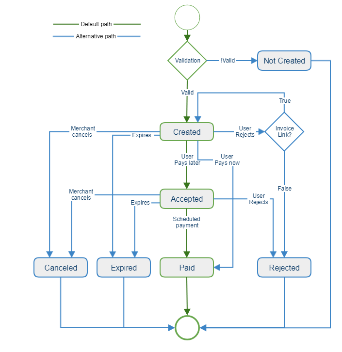
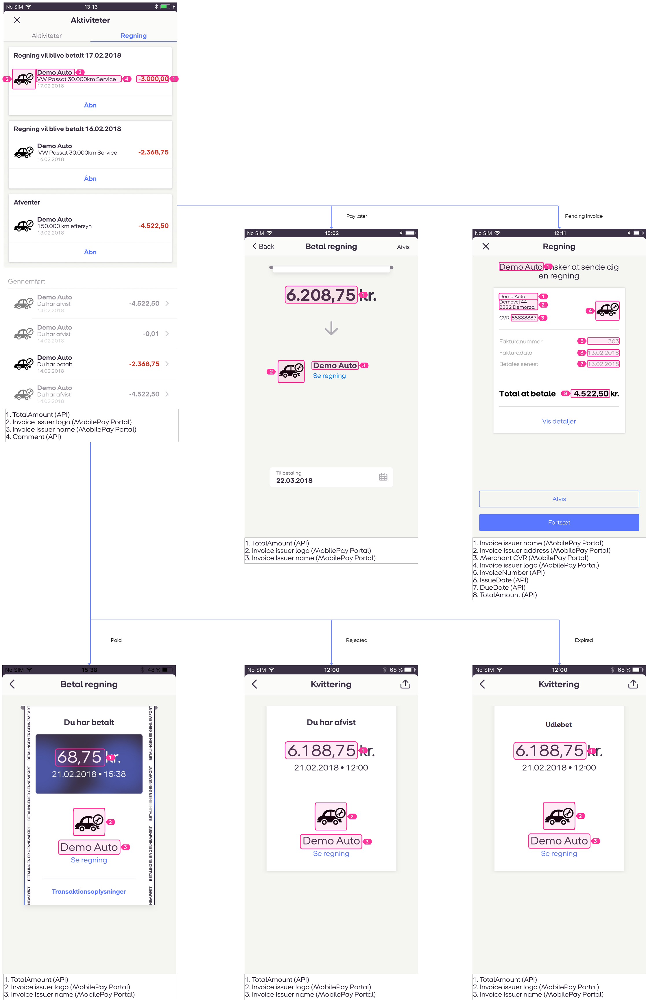

## <a name="overview"/> Overview

Billing your customers with MobilePay Invoice is easy using our MobilePay Invoice Api's.<br />
This document explains how to make a technical integration to the MobilePay Invoice product. The audience for this document is either technical integrators acting on behalf of merchants, or merchant creating their own integrations.

### <a name="overview_available"></a>Where is Invoice available ?

- Denmark
- Finland

## <a name="integration"/> Integration     
Integrating to MobilePay invoice is technically a multistep process involving creating an application interacting with our systems via our API gateway, subscribing to the invoice product and calling the invoice RESTful API's.<br />

In the sections below, the following steps will be explained.
1. Merchant onboarding  
2. Subscribing to the Invoice product through the API gateway
3. Using OpenID Connect enabling integrators to call the invoice API on-behalf of merchants
4. How does the Invoice API look like and how is it called.

### <a name="merchant_onboarding"/> Merchant Onboarding
As a merchant wanting to send invoices via MobilePay, you enroll to the product via [MobilePay.dk](http://www.MobilePay.dk) or the MobilePay Business Administration portal. Here you will find information about our products as well as an easy way of enrolling. As an integrator or 3rd party service provider acting on behalf of a merchant, you need your customer to enroll to the product prior to doing the integration.<br />
During the first product enrollment, you, as a merchant, will be requested details about your company such as company size, type etc. You will also be asked to confirm the account(s) you wish to use. These informations are required in order for us to verify your company information to be able to transfer the money to you securely. <br />

During the enrollment you will also be given the option to define parameters such as name, logo, address, etc. for how your MobilePay Invoice Issuer should reflect your company in MobilePay.

<a name="apigateway"/>  

### API Gateway     

The first step needed in order to integrate to MobilePay invoice is obtaining access to the sandbox environment. The sandbox environment is a production like environment used in MobilePay to test technical integrations. The environment is located [here](https://sandbox-developer.mobilepay.dk/).<br />

Make sure that it is clear that the invoice product is wanted when requesting access. Once logged in, create an app representing your application. This will yield a client id and a secret -remember these as they are needed in every call. After this, navigate to the invoice product and subscribe with your newly created app. All facilities and information for testing connection will be available inside the sandbox environment when logged in.

<a name="openidconnect"/>  

### OpenID Connect

When the merchant is onboarded, he has a user in MobilePay that is able to manage which products the merchant wishes to use. Not all merchants have the technical capabilities to make integrations to MobilePay, instead they may need to go through applications whith these capabilities. In order for this to work, the merchant must grant consent to an application with these capabilities. This consent is granted through mechanism in the [OpenID Connect](http://openid.net/connect/) protocol suite.<br />

The OpenID Connect protocol is a simple identity layer on top of the OAuth 2.0 protocol. Integrators are the same as clients in the OAuth 2.0 protocol. The first thing that must be done as a client is to go and register [here]( https://www.mobilepay.dk/da-dk/Erhverv/Pages/MobilePay-integrator.aspx). Once this is done the client must initiate the [hybrid flow](http://openid.net/specs/openid-connect-core-1_0.html#HybridFlowAuth) specified in OpenID connect. For invoices the client must request consent from the merchant using the 'invoice' scope. The authorization server in sandbox is located  https://sandprod-admin.mobilepay.dk/account/connect/authorize <br />

If the merchant grants consent, an authorization code is returned which the client must exchange for an id token, an access token and a refresh token. The refresh token is used to refresh ended sessions without asking for merchant consent again. This means that if the client receives an answer from the api gateway saying that the access token is invalid, the refresh token is exchanged for a new access token and refresh token.

An example of how to use OpenID connect in C# can be found [here](https://github.com/MobilePayDev/MobilePay-Invoice/tree/master/ClientExamples).

### <a name="openid-flow"></a> OpenID flow
[](assets/images/openid_flow_0.png)

### <a name="supported-endpoints"></a> Supported Endpoints 
Find the supported endpoints in the links below 

|Environment | Links                               |
|-----------|------------------------------------------|
|Sandbox    |https://api.sandbox.mobilepay.dk/merchant-authentication-openidconnect/.well-known/openid-configuration        |
|Production   |https://api.mobilepay.dk/merchant-authentication-openidconnect/.well-known/openid-configuration      |


## <a name="general-notes"/> General notes

### <a name="invoice_issuer"></a> Invoice issuer

**Invoice Issuer** represents mercant company information. Before using **Invoices** merchant must have at least one **Invoice Issuer** which can be created via the MobilePay Business Administration portal. Each **Invoice Issuer** contains its own address information, account data and logo.

To get merchant **Invoice Issuers** use `GET /api/v1/merchants/{merchantId}/invoiceissuers` method. Response contains an array of **Invoice Issuer** objects:

```json
{
  "InvoiceIssuers": [
    {
      "Id": "00000000-0000-0000-0000-000000000000",
      "Name": "string",
      "AccountType": "string"
    }
  ]
}
```

### <a name="merchant_id"></a> MerchantId

**MerchantId** is a unique identifier used correctlly determine **Invoices** merchant. After **Access Token** retrieval from Open ID flow use `GET /api/v1/merchants/me` endpoint to retrieve **MerchantId** for a provided **Access Token**. Response contains single property:

##### HTTP 200 Response body example

```json
{
  "MerchantId": "00000000-0000-0000-0000-000000000000"
}
```

### <a name="invoice_status"></a> Invoice status

The table below shows possible status, status_text and status_code values depending on the **Invoice** status changes.

|New Status | Condition                               |
|-----------|------------------------------------------|
|Created    |_Merchant created the Invoice_            |
|Invalid    |_Invoice validation failed_               |
|Accepted   |_User swiped to accept the Invoice_       |
|Paid       |_Invoice was paid_|
|Rejected   |_User tapped the reject button during the signup_    |
|Expired    |_User did not do anything during the invoice timeout period._      |


### <a name="invoice-flow"/> Invoice flow

**Invoice** status flow can be visualized by the following diagram.

[](assets/images/invoice_flow.png)

#### <a name="invoice_status_request_parameters"></a> Request parameters

There is no JSON input model in this endpoint, instead, format the request the in the following way: <br />
`GET api/v1/merchants/{merchantId}/invoices/{invoiceId}/status`

The response of `GET api/v1/merchants/{merchantId}/invoices/{invoiceId}/status` contains two properties:
* **InvoiceId** - a unique id of the invoice.
* **Status** - a status of the invoice.

##### HTTP 200 Response body example

```json
{
    "InvoiceId" : "5e1210f9-4153-4fc3-83ec-2a8fc4843ea6",
    "Status" : "Created"
}
```

All dates and time-stamps use the ISO 8601 format: date format - `YYYY-MM-DD` , date-time format - `YYYY-MM-DDTHH:mm:ssZ` .

Amounts are enquoted with double quotation marks using `0.00` format, decimals separated with a dot.

### <a name="errors"></a> Errors
Possible error responses contain these five properties:

* **correlation_id** - a unique id used for logging and debugging purposes.
* **error** - a string specifying error type. Possible values: `DomainError`, `InputError` & `ServerError`
* **error_code** - integer specifying error unique code.
* **error_description** - a string indetifying human friendlly error description.
* **error_context** - a string indetifying context in which error has occured.


1. `HTTP 400` , if request input is invalid
>
  ```json
  {
      "correlation_id": "54ccc98b-7d9f-40ea-8c1a-249d57126c39",
      "error": "InputError",
      "error_code": null,
      "error_description": "input.TotalAmount : Invalid input\r\n",
      "error_context": "Invoices"

}
  ```

2. `HTTP 409` , request is not compatible with a current state
>
  ```json
  {
      "correlation_id": "8c153279-98f1-4e33-b053-3c6e3555adff",
      "error": "DomainError",
      "error_code": "10504",
      "error_description": "Invoice has already been paid",
      "error_context": "Invoices"
  }
  ```

3. `HTTP 500` , server error
>
  ```json
  {
      "correlation_id": "56db684c-7845-4abf-9f19-5632a625a47b",
      "error": "ServerError",
      "error_code": null,
      "error_description": "The given key was not present in the dictionary.",
      "error_context": "Invoices"
  }
  ```


### <a name="payment-screens"></a> Payment Screens
[](assets/images/pay_invoice_1.png)

### <a name="review-invoice"></a> Review Invoice
[](assets/images/review_invoice_1.png)

### <a name="pdf"></a> PDF

[](assets/images/pdf.png)

[PDF_generation.pdf](https://github.com/MobilePayDev/MobilePay-Invoice/blob/master/docs/assets/pdf/PDF_generation.pdf)

### <a name="validation"/> Validation

A set of business rules apply for an **Invoice** before it gets created. If any of following rules fail, an **Invoice** falls to `Not Created` state and an error response with Error Code and Description is returned

|Field            |Country          |Validation                                         |Error Code |Description                                                         |
|-----------------|-----------------|---------------------------------------------------|-----------|--------------------------------------------------------------------|
|**DueDate**      |DK/FI            |*CreatedDate < DueDate < CreatedDate + 400(days)*  |10310/10311|Due Date must be no more than 400 days in the future                |
|**IssueDate**    |DK/FI            |*IssueDate >= CreatedDate*                         |10312      |Issue Date can not be later than Invoice Creation date              | 
|**CountryCode**  |DK/FI            |*CountryCode == Consumer CountryCode*              |10106      |Country Code must match Consumer Country Code                       | 
|**CurrencyCode** |DK               |*CurrencyCode == DKK*                              |10107      |Only DKK is supported for DK Invoices                               |
|                 |FI               |*CurrencyCode == EUR*                              |10107      |Only EUR is supported for FI invoices                               |
|**TotalAmount**  |DK               |*TotalAmount <= 10000 DKK*                         |10201      |Total Amount is limited to 10000 DKK                                |
|                 |FI               |*TotalAmount <= 500 EUR*                           |10201      |Total Amount is limited to 500 EUR                                  |
|*Limits*         |DK/FI            |*Consumer Daily Invoice Count < 50*                |10313      |No more then 49 Invoices can be created per Consumer from single Merchant|
|*Limits*         |DK/FI            |*Invoice Issuer Daily Invoice Count < 5000*        |10314      |No more then 4999 Invoices can be created per Invoice Issuer per day|

## <a name="invoice-direct"/>  InvoiceDirect
### Single invoice

When the **Consent** between **Merchant** and the **Integrator** is established, use the `POST api/v1/merchants/{merchantId}/invoices` endpoint to en-queue **Invoice**.

```json
{
  "InvoiceIssuer": "efd08c19-24cf-4833-a4a4-bfa7bd58fbb2",
  "ConsumerAlias": {
    "Alias": "+4577007700",
    "AliasType": "Phone"
  },
  "ConsumerName": "Consumer Name",
  "TotalAmount": 360,
  "TotalVATAmount": 72,
  "CountryCode": "DK",
  "CurrencyCode": "DKK",
  "ConsumerAddressLines": [
    "Paradisæblevej 13",
    "CC-1234 Andeby", 
    "WONDERLAND"
  ],
  "DeliveryAddressLines": [
    "Østerbrogade 120",
    "CC-1234 Andeby",
    "WONDERLAND"
  ],
  "InvoiceNumber": "301",
  "IssueDate": "2018-02-12",
  "DueDate": "2018-03-12",
  "OrderDate": "2018-02-05",
  "DeliveryDate": "2018-02-10",
  "Comment": "Any comment",
  "MerchantContactName": "Snowboard gear shop",
  "MerchantOrderNumber": "938",
  "BuyerOrderNumber": "631",
  "PaymentReference": "186",
  "InvoiceArticles": [
    {
      "ArticleNumber": "1-123",

"ArticleDescription": "Process Flying V Snowboard",
      "VATRate": 25,
      "TotalVATAmount": 72,
      "TotalPriceIncludingVat": 360,
      "Unit": "1",
      "Quantity": 1,
      "PricePerUnit": 288,
      "PriceReduction": 0,
      "PriceDiscount": 0,

"Bonus": 5
    }      
  ]
}
```

The *Created* **Invoice**, if not accepted, will expire 30 days after due date.
### <a name="request_parameters"></a> Request parameters

|Parameter             |Sub Parameter |Type        |Required  |Description                                       |Valid values|
|----------------------|--------------|------------|----------|--------------------------------------------------|------------|
|**InvoiceIssuer**  |              |guid        | required |*The ID of the invoicing department/branch of the merchant*|5e1210f9-4153-4fc3-83ec-2a8fc4843ea6|
|**ConsumerAlias**     |              |            | required |*Mobile alias of the MobilePay user to be invoiced*||
|    | **Alias**  |string      | required |*Alias value of the MobilePay user*|e.g. +4512345678 or +35812345678|
|    | **AliasType**  |string      | required |*Alias type of the MobilePay user*|Phone|
|**ConsumerName**      |              |string      | required |*Full name of the MobilePay user*|Free text, Contact Name|
|**TotalAmount**       |              |number(0.00)| required |*The requested amount to be paid.*|>= 0.00, decimals separated with a dot.|
|**TotalVatAmount**    |              |number(0.00)| required |*VAT amount*|>= 0.00, decimals separated with a dot.|
|**CountryCode**       |              |string(2)   | required |*Country code*| DK |
|**CurrencyCode**      |              |string(3)   | required |*Currency code*|DKK |
|**ConsumerAddressLines**|            |string      | required |*Address of consumer receiving the invoice*|Free text|
|**DeliveryAddressLines**|            |string      |          |*Delivery address*|Free text|
|**InvoiceNumber**     |              |string      | required |*Invoice Number*|Free text e.g. 123456798ABCD|
|**IssueDate**         |              |date        | required |*Issue date of invoice*|ISO date format: YYYY-MM-DD|
|**DueDate**           |              |date        | required |*Payment due date. Must be between today and +400 days ahead, otherwise the Request will be declined.*|ISO date format: YYYY-MM-DD|
|**OrderDate**         |              |date        | required |*Order date of invoice*|ISO date format: YYYY-MM-DD|
|**DeliveryDate**      |              |date        | required |*Delivery date of invoice*|ISO date format: YYYY-MM-DD|
|**Comment**           |              |string      |          |*Free text of additional information to the consumer*|Free text|
|**MerchantContactName**|             |string      |          |*Contact name for the individual who issued the invoice*|Free text, Name|
|**MerchantOrderNumber**|             |string      |          |*The merchant order number for the invoice used internally by the merchant*|Free text e.g. 123456798ABCD|
|**BuyerOrderNumber**|              |string      |          |*The buyer order number for the invoice used externally by the merchant*|Free text e.g. 123456798ABCD|
|**PaymentReference**  |              |string(60)  |          |*Reference used on the payment to do reconciliation. If not filled, invoice number will be used as reference*|Free text e.g. 123456798ABCD|
|**InvoiceArticles** |              |  list          | required |*At least one invoice article is required*||
|    |**ArticleNumber**               |string      |          |*Article Number*|e.g. 123456ABC|
|    |**ArticleDescription**          |string      |          |*Article Description*|Free text|
|    |**VATRate**                     |number(0.00)|          |*VAT Rate of article*|>= 0.00, decimals separated with a dot.|
|    |**TotalVATAmount**              |number(0.00)|          |*Total VAT amount of article*|>= 0.00, decimals separated with a dot.|
|    |**TotalPriceIncludingVat**      |number(0.00)|          |*Total price of article including VAT*|>= 0.00, decimals separated with a dot.|
|    |**Unit**                        |string      |          |*Unit*|e.g. Pcs, Coli|
|    |**Quantity**                    |number(0.00)|          |*Quantity of article*|>= 0.00, decimals separated with a dot.|
|    |**PricePerUnit**                |number(0.00)|          |*Price per unit*|>= 0.00, decimals separated with a dot.|
|    |**PriceReduction**              |number(0.00)|          |*Price reduction*|>= 0.00, decimals separated with a dot.|
|    |**PriceDiscount**               |number(0.00)|          |*Price discount*|>= 0.00, decimals separated with a dot.|
|    |**Bonus**                       |number(0.00)|          |*Bonus of article*|>= 0.00, decimals separated with a dot.|

The `POST api/v1/merchants/{merchantId}/invoices` service returns HTTP 202 - Accepted response if **Invoice** with at least one article is provided in the request payload.

The response body contains property:
* **InvoiceId** - a unique id of the **Invoice**, that was accepted for processing and now is in a _Created_ state.
##### <a name="http202_response_body_example"></a> HTTP 202 Response body example

```json
{
    "InvoiceId" : "63679ab7-cc49-4f75-80a7-86217fc105ea"
}
```

## <a name="invoice-link"/> InvoiceLink

Merchant can create a **Link** to **Invoice** that is sent to **Customer** via email, allowing them to pay using **MobilePay**.
Use the `POST api/v1/merchants/{merchantId}/invoices/link` endpoint to generate an **InvoiceLink**. This service accepts a JSON object of single **Invoice** to be processed asynchronously. Notice that the **Invoice** payload does not require a customer alias - **Invoice** can be paid by any **MobilePay** user.

```json
{
  "InvoiceIssuer": "efd08c19-24cf-4833-a4a4-bfa7bd58fbb2",
  "ConsumerAlias": {
    "Alias": "+4577007700",
    "AliasType": "Phone"
  },
  "ConsumerName": "Consumer Name",
  "TotalAmount": 360,
  "TotalVATAmount": 72,
  "CountryCode": "DK",
  "CurrencyCode": "DKK",
  "ConsumerAddressLines": [
    "Paradisæblevej 13",
    "CC-1234 Andeby", 
    "WONDERLAND"
  ],
  "DeliveryAddressLines": [
    "Østerbrogade 120",
    "CC-1234 Andeby",
    "WONDERLAND"
  ],
  "InvoiceNumber": "301",
  "IssueDate": "2018-02-12",
  "DueDate": "2018-03-12",
  "OrderDate": "2018-02-05",
  "DeliveryDate": "2018-02-10",
  "Comment": "Any comment",
  "MerchantContactName": "Snowboard gear shop",
  "MerchantOrderNumber": "938",
  "BuyerOrderNumber": "631",
  "PaymentReference": "186",
  "InvoiceArticles": [
    {
      "ArticleNumber": "1-123",
      "ArticleDescription": "Process Flying V Snowboard",
      "VATRate": 25,
      "TotalVATAmount": 72,
      "TotalPriceIncludingVat": 360,
      "Unit": "1",
      "Quantity": 1,
      "PricePerUnit": 288,
      "PriceReduction": 0,
      "PriceDiscount": 0,
      "Bonus": 5
    }      
  ]
}
```
#### <a name="invoice-link-request-parameter"/> Invoice Link Request parameters

|Parameter             |Sub Parameter   |Type        |Required  |Description                                                 |Valid values|
|:---------------------|:---------------|:-----------|:---------|:-----------------------------------------------------------|:-----------|
|**InvoiceIssuer**     |                     | guid       | required |*The ID of the invoicing department/branch of the merchant*|5e1210f9-4153-4fc3-83ec-2a8fc4843ea6|
|**ConsumerAlias**     |                     | object     |          |*Mobile alias of the MobilePay user to be invoiced*| |
|                      | **Alias**           |string      | required |*Alias value of the MobilePay user*| e.g. 004512345678, 12345678, +4512345678|
|                      | **AliasType**       |string      | required |*Alias type of the MobilePay user*| Phone |
|**ConsumerName**       |   | string | required  |*Full name of the MobilePay user*| Free text e.g. Contact Name|
|**TotalAmount**        |   | decimal | required |*The requested amount to be paid.*|>= 0.00, decimals separated with a dot.|
|**TotalVATAmount**     |   | decimal | required |*VAT amount*| >= 0.00, decimals separated with a dot. |
|**CountryCode**        |   | string | required |*Country code*| DK, FI |
|**CurrencyCode**       |   | string | required |*Currency code*| DKK, EUR |
|**ConsumerAddressLines**    |   | string[] | At least one |*Address of consumer receiving the invoice*| Free text |
|**DeliveryAddressLines**    |   | string[] |  |*Delivery address*| Free text |
|**InvoiceNumber**      |   | string | required |*Invoice Number*| Free text e.g. 123456798ABCD |
|**IssueDate**          |   | Date | required |*Issue date of invoice*| ISO date format: YYYY-MM-DD |
|**DueDate**            |   | Date | required |*Invoice payment due date. Must be between today and +400 days ahead, otherwise the Request will be declined*| ISO date format: YYYY-MM-DD |
|**OrderDate**          |   | Date | required |*Order date of invoice* | ISO date format: YYYY-MM-DD |
|**DeliveryDate**       |   | Date |  |*Delivery date of invoice* | ISO date format: YYYY-MM-DD |
|**Comment**            |   | string |  |*Free text of additional information to the consumer*| Free text |
|**MerchantContactName**     |   | string |  |*The merchant Contact name for the individual who issued the invoice*| Free text, Name |
|**MerchantOrderNumber**     |   | string |  |*The merchant order number for the invoice used internally by the merchant*| Free text e.g. 123456798ABCD |
|**BuyerOrderNumber**        |   | string |  |*The buyer order number for the invoice used externally by the merchant*| Free text e.g. 123456798ABCD |
|**PaymentReference**        |   | string |  |*Reference used on the payment to do reconciliation. If not filled, invoice number will be used as reference*| Free text e.g. 123456798ABCD |
|**InvoiceArticles**         |   | list | required |*At least one invoice article is required*|  |
|               |  **ArticleNumber** | string |  |*Article Number*| e.g. 123456ABC |
|               | **ArticleDescription**  | string |  |*Article description*| Free text |
|               | **VATRate** | decimal |  |*VAT Rate of article*| >= 0.00, decimals separated with a dot. |
|               | **TotalVATAmount** | decimal |  |*Total VAT amount of article*| >= 0.00, decimals separated with a dot. |
|               | **TotalPriceIncludingVat**  | decimal |  |*Total price of article including VAT*| >= 0.00, decimals separated with a dot. |
|               | **Unit**  | decimal |  |*Unit*| e.g. Pcs, Coli |
|               | **Quantity**  | decimal |  |*Quantity of article*| >= 0.00, decimals separated with a dot. |
|               | **PricePerUnit**  | decimal |  |*Price per unit*| >= 0.00, decimals separated with a dot. |
|               | **PriceReduction**  | decimal |  |*Price reduction*| >= 0.00, decimals separated with a dot. |
|               | **PriceDiscount**  | decimal |  |*Price discount*| >= 0.00, decimals separated with a dot. |
|               |  **Bonus**    | decimal |  |*Bonus of article*| >= 0.00, decimals separated with a dot. |

The `POST /api/v1/merchants/{merchantId}/invoices/link` service returns HTTP 202 - Accepted response if **Invoice** with at least one  article is provided in the request payload.

The response body contains two properties:
* **InvoiceId** - a unique id of the **Invoice**, that was accepted for processing and now is in a _Created_ state.
* The link **Rel = user-redirect** - value contains the hyperlink reference address, which is structured in the following way: _https://&lt;mobile-pay-invoice-restapi&gt;/&lt;path-to-invoices&gt;/{invoice_id}/link_. The invoice_id property is of type guid and uniquely identifies the **Invoice** for the app to get the details and subsequently do an accept request.


##### HTTP 202 Response body example
```json
{
    "InvoiceId": "c5d4fde3-81e2-49de-8cfe-8c96f449e367",
    "Links": [
        {
            "Rel": "user-redirect",
            "Href":"https://api.sandbox.mobilepay.dk/invoice-restapi/api/v1/consumers/me/invoices/invoices/c5d4fde3-81e2-49de-8cfe-8c96f449e367/link"
        }
    ]
}
```

The **Invoice link** can be used in two ways:

1. Redirect the user automatically using the HTTP response **302** or **303**. Once the user is redirected, the **MobilePay** app will be opened to activate the **Invoice**.
2. E-mail the generated **Invoice link** to the user. Once the user clicks on the **Invoice link**, the **MobilePay** app will be opened to activate the **Invoice**. Note, that the **Invoice link** will be valid only until the user accepts the **Invoice** or it will expire 30 days after due date.

 [](assets/images/lp/d_flow.png)

If consumer opens **Invoice link** on phone flow is simplified.
 [](assets/images/lp/s_flow.png)
 
## <a name="batch-requests"/> Creating multiple invoices in one batch
We now provide an API to create multiple invoices in a single batch
 
#### <a name="batch-invoice-direct" /> InvoiceDirect
 
You can `POST api/v1/merchants/{merchantId}/invoices/batch` with an array of [InvoiceDirect requests](#request_parameters) to create multiple InvoiceDirect invoices.
```json
[
  {
     InvoiceDirect input
  },
  {
     InvoiceDirect input
  },
  ...
]
```

#### <a name="batch-invoice-link" /> InvoiceLink

You can `POST api/v1/merchants/{merchantId}/invoices/link/batch` with an array of [InvoiceLink requests](#invoice-link-request-parameter) to create multiple InvoiceLink invoices.
```json
[
  {
    InvoiceLink input,
  },
  {
    InvoiceLink input,
  },
  ...
]
```

#### Batch response
Both for InvoiceDirect and InvoiceLink batches, the response will look the same
```json
{
  "Accepted": [
    {
      "InvoiceNumber": "<original invoice number sent by the merchant>",
      "InvoiceId": "66119129-aaf7-4ad0-a5b1-62382932b5c6"
    },
    {
      "InvoiceNumber": "<original invoice number sent by the merchant>",
      "InvoiceId": "5e3030a3-61ff-4143-a6bd-8457a09bcb0d"
    },
    ...
  ],
  "Rejected": [
    {
      "InvoiceNumber": "<original invoice number sent by the merchant>",
      "ErrorText": "<description of error>",
      "ErrorCode": 10504
    },
    ...
  ]
}
```

The success response for InvoiceDirect is not much different from the regular, non-batch response, but you will notice, that InvoiceLink responses don't contain the link itself. This is because we are processing batches asynchronously and so can not return an immediate result. The link URLs will be sent back to you via a callback, as soon as they're created.


## <a name="callbacks" /> Callbacks
In order to receive callbacks about [status](#invoice_status) changes for an invoice a callback URL must be specified first. But before setting your callback URL you must choose prefered authentication method which we will use for authenticating our requests when calling your callback URL. Currently we support [Basic](https://tools.ietf.org/html/rfc7617) and _ApiKey_ authentication methods:  

1) `PUT /api/v1/merchants/{merchantId}/auth/basic`
```json 
{
  "username": "Username",
  "password": "MySecretPswd",
  "callback_url": "https://your.url/callbacks/invoice"
}
```

2) `PUT /api/v1/merchants/{merchantId}/auth/apikey` 
```json
{
  "api_key": "SomeSecretApiKey123",
  "callback_url": "https://your.url/callbacks/invoice"
}
```
Using _ApiKey_ authentication method your provided ApiKey will be simply added to **_Authorization_** header.

Example of our callback body:

```json
[
  {
    "InvoiceId": "3c440dfb-b271-4d21-ad1c-f973f2c4f448",
    "Status": "Rejected",
    "Date":"2018-04-24T07:29:47.7500268+00:00"
  },
  {
    "InvoiceId": "3c440dfb-b271-4d21-ad1c-f973f2c4f449",
    "Status": "Invalid",
    "ErrorCode": 10106,
    "ErrorMessage": "<description of error>",
    "Date":"2018-04-24T07:29:47.7500268+00:00"
  },
  ...
]
```

---
**NOTE:** When status of an invoice is **Invalid** two additional fields will be added: _ErrorCode_ and _ErrorMessage_. All possible validation errors can be found in [Validation](#validation) section.

---

A callbacks about created **InvoiceLinks** which were created asynchronously using [batch endpoint](#batch-invoice-link) will contain additional field **_Links_** with **Rel="user-redirect"** and **Href** to the page where MobilePay users can accept an invoice, e.g.:
```json
[
  {
    "InvoiceId": "3c440dfb-b271-4d21-ad1c-f973f2c4f448",
    "Status": "Created",
    "Links": [
      {
        "Rel": "user-redirect",
        "Href": "<url-for-accepting-invoice>"
      }
    ],
    "Date":"2018-04-24T07:29:47.7500268+00:00"
  },
  ...
]
```

### <a name="credit_invoice"></a> Crediting an unpaid invoice _(Coming Soon)_
Use `PUT api/v1/merchants/{merchantId}/invoices/{invoiceId}/credit` to credit an invoice which has not yet been paid, rejected and has not expired. There is no response body, in case the operation is successful, you'll get HTTP 204 NoContent response back, otherwise you'll get a standard error response.
