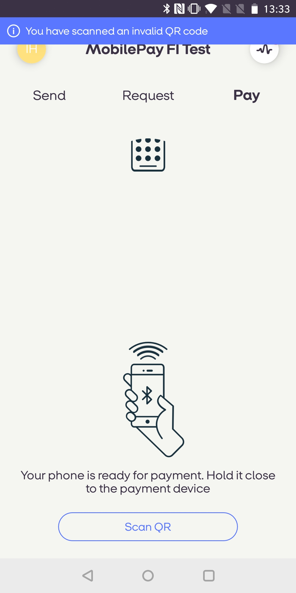

## Invoice 1.4 Release Notes
 <div class='post-date'> </div>


### <a name="response_code"></a> 06 august 2019 - Response Code 
The response codes for invoices have been unified. Batch requests now return <code>202</code> , all others should now return <code>200</code> If the merchant's logic examines the concrete response code, the merchant or integrator may have to change their logic in order to cope with the change in response code. We do not consider this a breaking chance, as most merchants only check if the call was a success, and do not depend on a concrete status code. 


### <a name="response_code"></a> 01 march 2019 - QR code

New feature: Scanning QR code with InvoiceLink will open MobilePay Invoice

We're excited to announce, that MobilePay's own QR code reader can now read a QR code, that contains InvoiceLink

- When you scan a QR with the MobilePay app, and the QR contains InvoiceLink, then the Invoice context screen is opened.
- If the scanned link is already expired, then the user will see an error message in the overlay screen
- If the invoice is expired, then the endpoint will return a 404 status

[](assets/images/android_fi2.jpg)    

### <a name="Merchant-PDF"></a> Provide your own PDF for invoice
Currenlty, PDF file of the invoice is generated internally by MobilePay. With release of **Invoice 1.4** merchants now have a possibility to provide the URL to their own PDF file.

If you create an invoice with <code>InvoiceUrl</code> parameter filled in, user will be redirected to the URL from the app when showing an invoice, otherwise the previous flow of showing PDF generated by MobilePay internally will apply.

The following endpoints will be extended to accept an optional <code>InvoiceUrl</code> parameter:

```
POST api/v1/merchants/{merchantId}/invoices
POST api/v1/merchants/{merchantId}/invoices/batch
POST api/v1/merchants/{merchantId}/invoices/link
POST api/v1/merchants/{merchantId}/invoices/link/batch
```

##### <a name="single_invoice_object"/> Input

|Parameter             |Type        |Description |
|----------------------|------------|------------|
|`InvoiceUrl`          |`string`    |URL to the Invoice PDF provided by merchant.|

<div class="note">
<strong>Note:</strong> Only HTTPS scheme URLs will be supported.
</div>

##### Create Invoice Direct example

```json
{
  "InvoiceIssuer": "efd08c19-24cf-4833-a4a4-bfa7bd58fbb2",
  "ConsumerAlias": {
    "Alias": "+4577007700",
    "AliasType": "Phone"
  },
  "ConsumerName": "Consumer Name",
  "TotalAmount": 360,
  "TotalVATAmount": 72,
  "CountryCode": "DK",
  "CurrencyCode": "DKK",
  "ConsumerAddressLines": [
    "Paradisæblevej 13",
    "CC-1234 Andeby", 
    "WONDERLAND"
  ],
  "DeliveryAddressLines": [
    "Østerbrogade 120",
    "CC-1234 Andeby",
    "WONDERLAND"
  ],
  "InvoiceNumber": "301",
  "IssueDate": "2018-02-12",
  "DueDate": "2018-03-12",
  "OrderDate": "2018-02-05",
  "DeliveryDate": "2018-02-10",
  "Comment": "Any comment",
  "MerchantContactName": "Snowboard gear shop",
  "MerchantOrderNumber": "938",
  "BuyerOrderNumber": "631",
  "PaymentReference": "186",
  "InvoiceArticles": [
    {
      "ArticleNumber": "1-123",
  "ArticleDescription": "Process Flying V Snowboard",
      "VATRate": 25,
      "TotalVATAmount": 72,
      "TotalPriceIncludingVat": 360,
      "Unit": "1",
      "Quantity": 1,
      "PricePerUnit": 288,
      "PriceReduction": 0,
      "PriceDiscount": 0,
      "Bonus": 5
    }      
  ],
  "InvoiceUrl": "https://www.merchant.dk/invoice/efd08c19-24cf-4833-a4a4-bfa7bd58123"
}
```
##### Create Invoice Link example

```json
{
  "InvoiceIssuer": "efd08c19-24cf-4833-a4a4-bfa7bd58fbb2",
  "ConsumerAlias": {
    "Alias": "+4577007700",
    "AliasType": "Phone"
  },
  "ConsumerName": "Consumer Name",
  "TotalAmount": 360,
  "TotalVATAmount": 72,
  "CountryCode": "DK",
  "CurrencyCode": "DKK",
  "ConsumerAddressLines": [
    "Paradisæblevej 13",
    "CC-1234 Andeby", 
    "WONDERLAND"
  ],
  "DeliveryAddressLines": [
    "Østerbrogade 120",
    "CC-1234 Andeby",
    "WONDERLAND"
  ],
  "InvoiceNumber": "301",
  "IssueDate": "2018-02-12",
  "DueDate": "2018-03-12",
  "OrderDate": "2018-02-05",
  "DeliveryDate": "2018-02-10",
  "Comment": "Any comment",
  "MerchantContactName": "Snowboard gear shop",
  "MerchantOrderNumber": "938",
  "BuyerOrderNumber": "631",
  "PaymentReference": "186",
  "InvoiceArticles": [
    {
      "ArticleNumber": "1-123",
      "ArticleDescription": "Process Flying V Snowboard",
      "VATRate": 25,
      "TotalVATAmount": 72,
      "TotalPriceIncludingVat": 360,
      "Unit": "1",
      "Quantity": 1,
      "PricePerUnit": 288,
      "PriceReduction": 0,
      "PriceDiscount": 0,
      "Bonus": 5
    }      
  ],
  "InvoiceUrl": "https://www.merchant.dk/invoice/efd08c19-24cf-4833-a4a4-bfa7bd58124"
}
```
