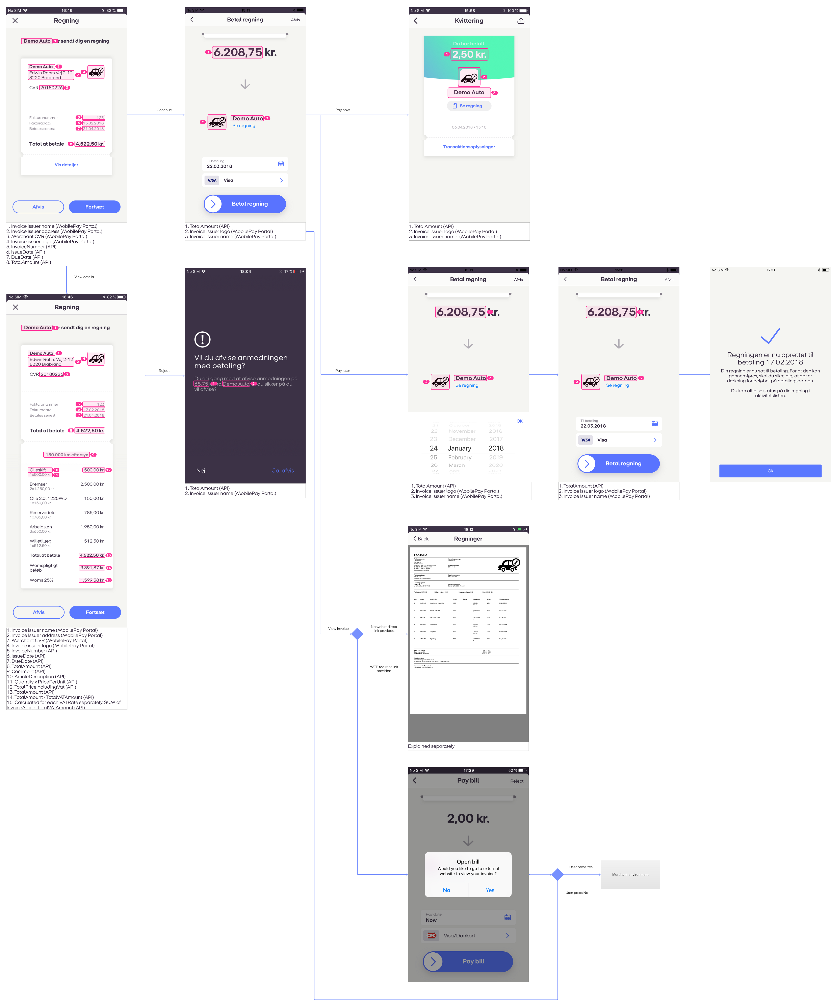
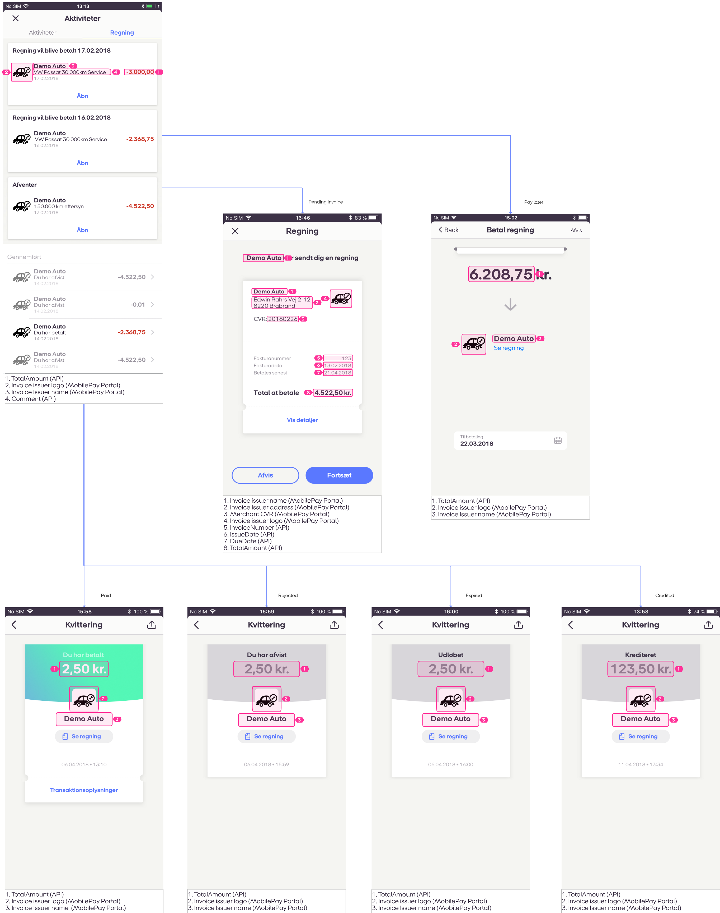

## Visual examples

###  Payment screens
Scheme represents flow when users opens invoice in the app and pays/schedules the payment.  Furthermore, it is explained what data of merchant/invoice issuer/invoice is used in the app and where.

###  Review invoice
Scheme represents flow when users reviews invoices in app activity list.  Furthermore, it is explained what data of merchant/invoice issuer/invoice is used in the app and where.

###  PDF example
Image explains what data of merchant/invoice issuer/invoice is used in the generated PDF and where.

[PDF_generation.pdf](https://github.com/MobilePayDev/MobilePay-Invoice/blob/master/docs/assets/pdf/PDF_generation.pdf)

###  InvoiceLink flows

#### Dual device flow
Scheme represents flow when user press on `InvoiceLink` link in the desktop device or tablet.

#### Single device flow
Scheme represents flow when user press on `InvoiceLink` link in the mobile device (except tablet).
