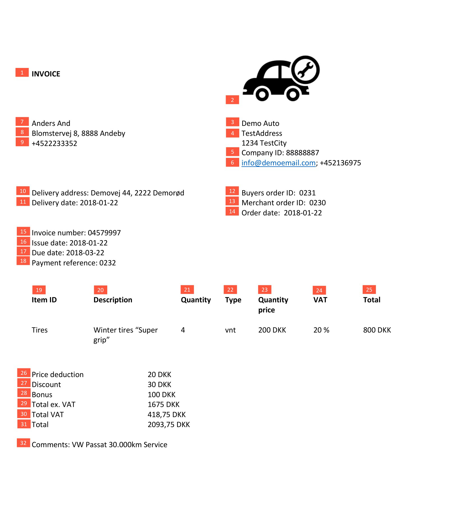

## Visual examples

###  InvoiceLink flows
#### Dual device flow

#### Single device flow

###  Payment screens

###  Review invoice

###  PDF example

[PDF_generation.pdf](https://github.com/MobilePayDev/MobilePay-Invoice/blob/master/docs/assets/pdf/PDF_generation.pdf)